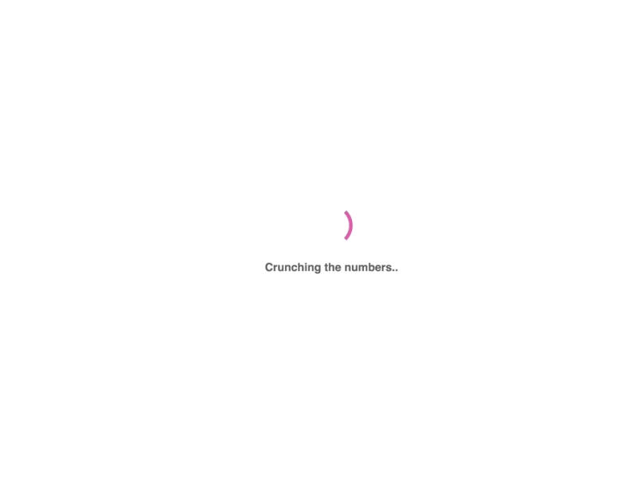

# Pinned 📌



Pinned grabs the pinned messages from Slack and turns them into a multiple choice quiz where your objective is to guess the original author of the pin! 😼

## Run Docker image

By far the easiest way to take Pinned for a spin on your local machine is by using Docker. Simply pull and run the image, pass in your Slack Token open your browser.

### Building yourself

To build from local Dockerfile, run:

```bash
docker build . -t pinned
```

### Pulling

Pull the latest version off of [DockerHub](https://hub.docker.com/r/tiemenwaterreus/pinned/)

```bash
docker pull tiemenwaterreus/pinned
```

### Running

Run the image

```bash
docker run --rm -d \
  -e "SLACK_TOKEN=<YOUR-SLACK-TOKEN-HERE>" \
  -e "SLACK_CHANNEL=general" \
  -p 4000:4000 \
  --name pinned \
  -t tiemenwaterreus/pinned:latest
```

**Note**: Make sure to replace the `<YOUR-SLACK-TOKEN-HERE>` in the environment variable `SLACK_TOKEN` with your own token.

Read how to obtain a _legacy_ Slack token over [here](https://api.slack.com/custom-integrations/legacy-tokens).

### Environment Variables

Other environment variables include:

| Variable       | Description                                           |
| -------------- | ----------------------------------------------------- |
| SLACK_TOKEN    | Your Slack Token                                      |
| SLACK_CHANNEL  | Channel from which we read the Pins. Default: General |
| NUM_CHALLENGES | How many pins to guess? Default: 5                    |
| NUM_CHOICES    | How many possible authors? Default: 4                 |
| SERVER_PORT    | What port is the Server listening on? Default: 4000   |

### Running the Demo version

If you pass `the_office` as `SLACK_TOKEN`, Pinned will actually run demo mode and present quotes from The Office (US) instead of fetching pins from slack. 🤷‍

## Run from Source

### Prerequisites

- Git
- Golang 1.11.x
- Node (10.x.x)
- [Foreman](https://rubygems.org/gems/foreman/versions/0.82.0) (Or other Procfile runner)

### Getting started

```bash
git pull github.com/tmw/pinned & cd pinned
```

In the pinned directory, you'll find tow directories. `frontend` and `backend`. `backend` contains all the Go code that communicates with the Slack API and exposes a small API to interface with the front-end.

The `frontend` folder contains all the front-end code and is built using create-react-app.

### Starting front-end

```bash
cd frontend
yarn start
```

create-react-app uses Yarn to build and watch the front-end directory and serves it with live-reload using a small development server.

### Starting back-end

```bash
cd backend
go get
go run main.go
```

Ever since Go 1.11 a Go project doesn't neccecerily have to live within the `$GOPATH` anymore. A simple `go get` and `go run` should do the trick here.

### Start using Foreman

If you're lazy enough and installed Foreman, just run:

```bash
foreman start
```

## Deployment on Zeit.co's Now

```bash
now login
now secret add slack_secret <YOUR_SLACK_TOKEN_HERE>
git pull github.com/tmw/pinned & cd pinned
now -e SLACK_TOKEN=@slack_token
```

## License

[MIT](./LICENSE)
